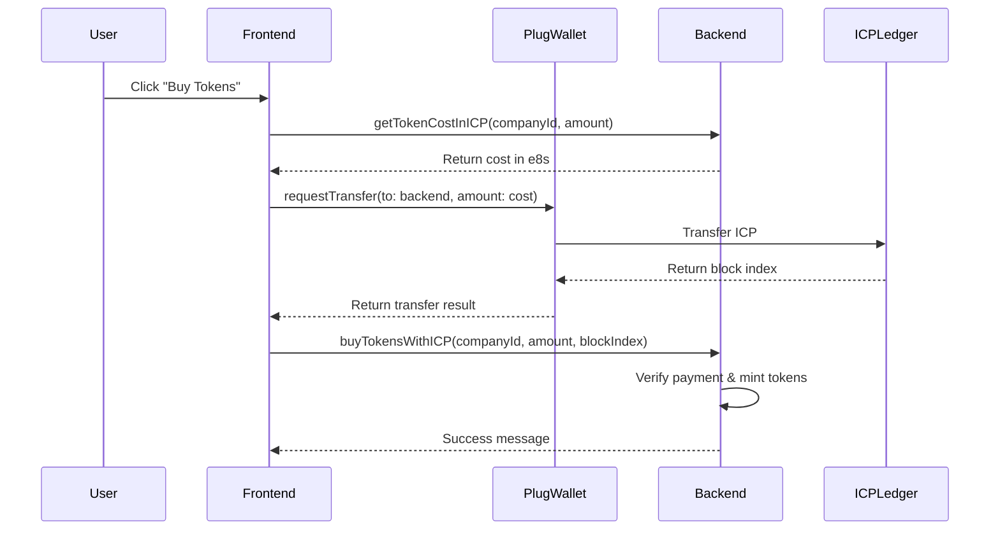
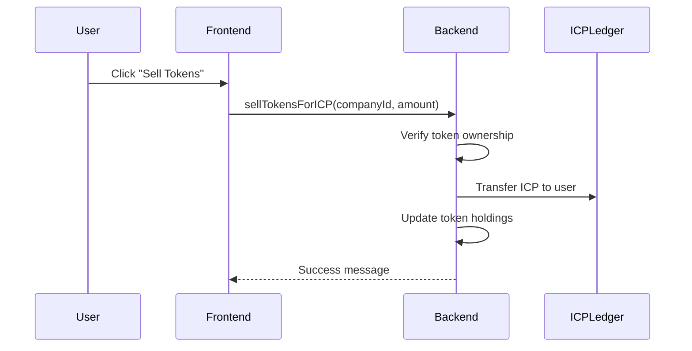

# Real ICP Transactions with Plug Wallet - Complete Implementation Guide

This guide shows you how to implement real ICP transactions in your Motoko smart contract with Plug wallet integration.

## Overview

Your current system has been updated to support real ICP payments for buying and selling tokens. Here's what has been implemented:

### Backend Changes (Motoko)

1. **ICP Ledger Integration** - Added interface to interact with the ICP ledger canister
2. **Payment Tracking** - Added `PaymentRecord` type to track all transactions
3. **New Functions**:
   - `getTokenCostInICP()` - Calculate cost in ICP e8s
   - `buyTokensWithICP()` - Buy tokens with real ICP payment verification
   - `sellTokensForICP()` - Sell tokens and receive ICP payout
   - `getPaymentHistory()` - View all payment transactions
   - `getUserPaymentHistory()` - View user-specific transactions

### Frontend Changes (TypeScript/React)

1. **Enhanced Backend Service** - Added functions to handle ICP payments
2. **Payment Component** - Created `ICPPaymentExample.tsx` demonstrating the complete flow
3. **Wallet Integration** - Extended Plug wallet interface for transfers

## How Real ICP Transactions Work

### Buying Tokens Flow



### Selling Tokens Flow



## Implementation Steps

### 1. Update Your Canister Configuration

First, update your `dfx.json` to include the ICP ledger canister:

```json
{
  "canisters": {
    "arks-rwa-backend": {
      "main": "src/arks-rwa-backend/main.mo",
      "type": "motoko"
    },
    "icp_ledger": {
      "type": "custom",
      "candid": "https://raw.githubusercontent.com/dfinity/ic/master/rs/rosetta-api/icp_ledger/ledger.did",
      "wasm": "https://download.dfinity.systems/ic/aca13d946c5d4e1b5b4a1b1c5c1b1c1b1c1b1c1b/canisters/ledger-canister.wasm.gz"
    }
  }
}
```

### 2. Deploy Your Updated Backend

```bash
# Build and deploy your backend with the new ICP integration
dfx build arks-rwa-backend
dfx deploy arks-rwa-backend
```

### 3. Configure Your Backend Canister Principal

Update the `BACKEND_CANISTER_PRINCIPAL` in `ICPPaymentExample.tsx`:

```bash
# Get your backend canister principal
dfx canister id arks-rwa-backend
```

Replace `your-backend-canister-principal-here` with the actual principal.

### 4. Test the Payment Flow

1. **Connect Plug Wallet**: Use the demo component to connect
2. **Calculate Costs**: The system automatically calculates ICP costs
3. **Make Payment**: Plug wallet handles the ICP transfer
4. **Verify Transaction**: Backend verifies and mints tokens

## Key Functions Explained

### Backend Functions

#### `getTokenCostInICP(companyId: Nat, amount: Nat)`
```motoko
// Returns the cost in ICP e8s for buying tokens
// Includes platform fees (1% by default)
public query func getTokenCostInICP(companyId : Nat, amount : Nat) : async { #ok : Nat; #err : Text }
```

#### `buyTokensWithICP(companyId: Nat, amount: Nat, paymentBlockIndex: Nat)`
```motoko
// Processes token purchase after ICP payment verification
// In production, this should verify the block index on the ICP ledger
public func buyTokensWithICP(companyId : Nat, amount : Nat, paymentBlockIndex : Nat) : async { #ok : Text; #err : Text }
```

#### `sellTokensForICP(companyId: Nat, amount: Nat)`
```motoko
// Sells tokens and initiates ICP payout to user
// In production, this should transfer ICP from platform account to user
public func sellTokensForICP(companyId : Nat, amount : Nat) : async { #ok : Text; #err : Text }
```

### Frontend Functions

#### `buyTokensWithICP()`
```typescript
// Handles the complete purchase flow:
// 1. Calculate cost
// 2. Request ICP transfer via Plug
// 3. Call backend with payment proof
const buyTokensWithRealICP = async () => {
  const totalCostE8s = await backendService.getTokenCostInICP(selectedCompany.id, tokenAmount);
  const transferResult = await window.ic.plug.requestTransfer(transferArgs);
  const purchaseResult = await backendService.buyTokensWithICP(selectedCompany.id, tokenAmount, blockIndex);
}
```

## Production Considerations

### 1. Payment Verification

In production, your backend should verify payments by querying the ICP ledger:

```motoko
// Verify that the payment actually occurred
let ledgerResult = await icpLedger.icrc1_balance_of({
  owner = Principal.fromActor(this);
  subaccount = null;
});
```

### 2. Error Handling

Implement robust error handling for:
- Network failures
- Insufficient funds
- Payment timeouts
- Duplicate transactions

### 3. Security

- Validate all inputs
- Implement rate limiting
- Use proper access controls
- Audit payment flows regularly

### 4. User Experience

- Show clear payment confirmations
- Display transaction history
- Handle wallet connection states
- Provide helpful error messages

## Testing

### Local Testing

1. **Start Local Replica**:
```bash
dfx start --clean
```

2. **Deploy Canisters**:
```bash
dfx deploy
```

3. **Test with Demo Mode**: The system includes demo mode for testing without real ICP

### Mainnet Testing

1. **Deploy to Mainnet**:
```bash
dfx deploy --network ic
```

2. **Use Small Amounts**: Test with minimal ICP amounts first

3. **Monitor Transactions**: Check ICP ledger for payment confirmations

## Common Issues and Solutions

### Issue: "Payment failed or was cancelled"
**Solution**: Check that Plug wallet is properly connected and has sufficient ICP balance.

### Issue: "Invalid company ID"
**Solution**: Ensure the company exists and the ID is correct.

### Issue: "Not enough tokens available"
**Solution**: Check the company's remaining token supply.

### Issue: TypeScript errors with Plug wallet
**Solution**: Use type assertions as shown in the example component.

## Next Steps

1. **Implement Payment Verification**: Add real ICP ledger verification
2. **Add Transaction History UI**: Create pages to view payment history
3. **Implement Refunds**: Handle failed transactions and refunds
4. **Add More Wallets**: Support Internet Identity and other wallets
5. **Optimize Gas Costs**: Minimize transaction fees where possible

## Example Usage

Check the `ICPPaymentExample.tsx` component for a complete working example of:
- Wallet connection
- Cost calculation
- Payment processing
- Error handling
- Status updates

This component demonstrates the entire flow and can be integrated into your existing application.

## Support

For issues or questions:
1. Check the ICP documentation: https://internetcomputer.org/docs
2. Review Plug wallet documentation: https://docs.plugwallet.ooo/
3. Test in demo mode first before using real ICP
4. Monitor the ICP ledger for transaction confirmations

Remember: Always test thoroughly with small amounts before deploying to production!